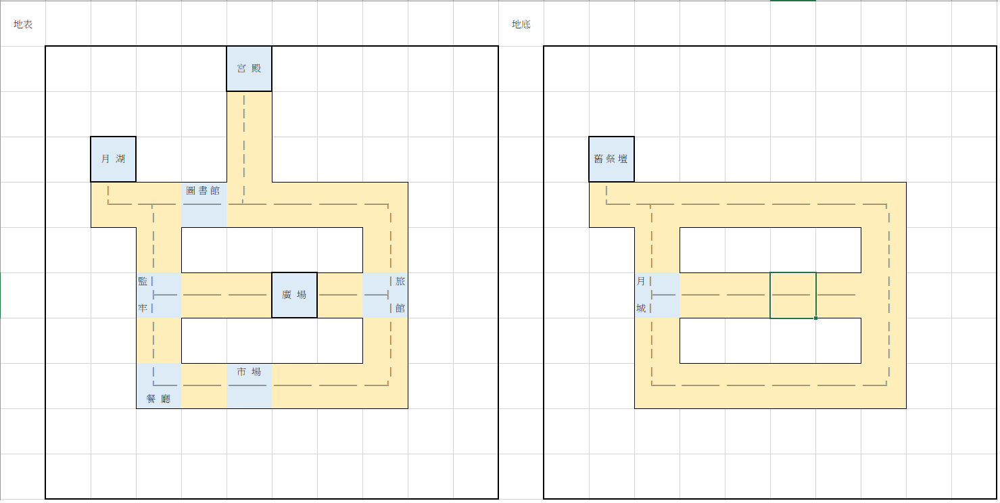

# 永晝城物語 (製作中)
## 遊戲說明
- 作者：曾煒傑、梁致銓、黃品瑜
- 時長：10\~12小時（跑團）、20\~30分鐘（遊戲）
- 難度：4/5（重Role Play）
- 推薦技能：御三家（偵查、聆聽、圖書館使用）
- 玩家職業：考古學家、神祕學家或記者等合理前往考古地點之職業
- 地點：1920英國
-  
## 劇情背景
一日調查員們聽說了英國出現能夠證明亞瑟王傳奇的遺址，而他們身為考古學領域中的翹楚被聘請去探索這個遺跡的真實性，而這個遺跡確實是亞瑟王時代留下的，但卻是邪神的祭壇，與神話紀載不同的是梅林並不是賢者而是一位格拉基的信徒，他謀劃了一切，從亞瑟王的出身到眾叛親離的終末，為的就只是為格拉基創造一個夢境神國，眾叛親離的亞瑟聽取了梅林的諫言，紅龍的血脈成為夢境的地基，他的王權與迷茫的內心成為了格拉基最佳的養料，而這夢境神國平和的運行直到調查員的出現。
## 角色介紹
- 約翰(Johann)
  - 
  - 一位30出頭的男性，有著一頭金色的雜亂中長髮，是此行的司機，也就是官方派來帶領調查員前往遺跡的導遊，他是一個熱情健談的人，喜歡與人聊天，他的夢想是成為一名唱作家，在車子的副駕放了一把 
    吉他，沒事時會拿起來彈，來接這次如此偏遠的載客工作就是因為想多賺點錢來完成夢想。
  -  <table>
     <tr>
        <th align="center">約翰(Johann)</th><th colspan="13" align="center">基礎數據</th>
     </tr>
     <tr>
         <td align="center">能力</td><td align="center">STR</td><td align="center">DEX</td><td align="center">INT</td><td align="center">CON</td><td                align="center">APP</td><td align="center">POW</td><td align="center">SIZ</td><td align="center">SAN</td><td align="center">EDU</td><td     
         align="center">Luck</td><td align="center">HP</td><td align="center">MP</td><td align="center">DB</td>
     </tr>
     <tr>
        <td align="center">數值</td><td align="center">65</td><td align="center">70</td><td align="center">50</td><td align="center">50</td><td                     align="center">40</td><td align="center">40</td><td align="center">40</td><td align="center">40</td><td align="center">40</td><td     
        align="center">50</td><td align="center">9</td><td align="center">8</td><td align="center">1D4</td>
     </tr>
     </table>
- 高文 Gawain(導遊瓦格恩 Wagain)
  - 
  - 太陽騎士: 太陽光的照射下，所有判定活得一顆優勢骰
  - 一位長得十分帥氣的男性，有著相對一般的白種人相對黑的淺麥色皮膚，淺天藍色的眼眸，伴隨著一抹淺淺的微笑映入你眼簾，他全身散發著讓人舒服的親合力。
  - Path: 曙: 廣場 >輝: 德茲瑪麗湖 >宏: 餐廳 >烈: 市場 >流: 旅店 >暮: 宮殿
  - 行事準則:
   
    會按照亞瑟為其設定的行為進行，但由於他並未處於幻境之中，所以他在所有的輪迴內會保持同樣的行為方式而非由冷落到熱情，他對待調查員們會回答大部分不影響到世界延續的問題，但不會
    耽誤他的行進路徑，除非調查員們能夠說服他令他覺得亞瑟王其實並不認為這樣下去是正確的，而實際上亞瑟也確實只是被梅林所蒙蔽後作為陣眼一般的存在活著，他在每一次輪迴的暮光時，也
    就是代表著亞瑟王落幕的時辰，他都會來到亞瑟的宮殿陪伴者亞瑟走過每一次的終末。
  -  <table>
     <tr>
        <th align="center">高文(Gawain)</th><th colspan="13" align="center">基礎數據</th>
     </tr>
     <tr>
         <td align="center">能力</td><td align="center">STR</td><td align="center">DEX</td><td align="center">INT</td><td align="center">CON</td><td                align="center">APP</td><td align="center">POW</td><td align="center">SIZ</td><td align="center">SAN</td><td align="center">EDU</td><td     
         align="center">Luck</td><td align="center">HP</td><td align="center">MP</td><td align="center">DB</td>
     </tr>
     <tr>
        <td align="center">數值</td><td align="center">80</td><td align="center">70</td><td align="center">85</td><td align="center">80</td><td                     align="center">85</td><td align="center">65</td><td align="center">75</td><td align="center">65</td><td align="center">50</td><td     
        align="center">80</td><td align="center">15</td><td align="center">13</td><td align="center">1D6</td>
     </tr>
     </table>
- 桂妮薇兒(Guinevere)
  - 
  - 一位長的十分漂亮的女性，你這輩子幾乎沒有看過比她更美麗的人，她有著一頭銀白色的長直髮，和湛藍色的眼眸，他穿著、行為高雅，一眼看去就不是普通人家。
  - Path: 曙: 房間 >輝: 房間 >宏: 客廳 >烈: 房間 >流: 房間 >暮: 房間
  - 行事準則:
    - 迷失狀態:會機械式的進行被安排的行動，理會調查員僅限於不會影響到形成的程度
    - 清醒狀態:雖然十分想念蘭斯洛特，且對自己的現狀有些痛苦，但她仍深陷背叛亞瑟王的罪惡感中，若不解開她的心結，她應該會在這座亞瑟王為她建立的城堡度過永遠。
清醒狀態:雖然十分想念蘭斯洛特，且對自己的現狀有些痛苦，但她仍深陷背叛亞瑟王的罪惡感中，若不解開她的心結，她應該會在這座亞瑟王為她建立的城堡度過永遠。
 
  -  <table>
     <tr>
        <th align="center">桂妮薇兒(Guinevere)</th><th colspan="13" align="center">基礎數據</th>
     </tr>
     <tr>
         <td align="center">能力</td><td align="center">STR</td><td align="center">DEX</td><td align="center">INT</td><td align="center">CON</td><td                align="center">APP</td><td align="center">POW</td><td align="center">SIZ</td><td align="center">SAN</td><td align="center">EDU</td><td     
         align="center">Luck</td><td align="center">HP</td><td align="center">MP</td><td align="center">DB</td>
     </tr>
     <tr>
        <td align="center">數值</td><td align="center">25</td><td align="center">55</td><td align="center">60</td><td align="center">35</td><td                     align="center">90</td><td align="center">45</td><td align="center">45</td><td align="center">65</td><td align="center">80</td><td     
        align="center">80</td><td align="center">6</td><td align="center">9</td><td align="center">-1</td>
     </tr>
     </table>
